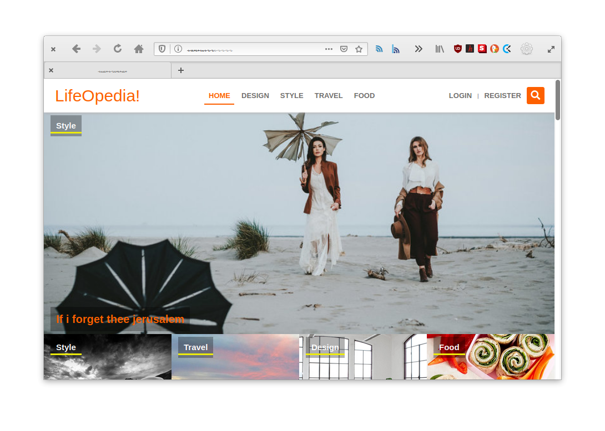
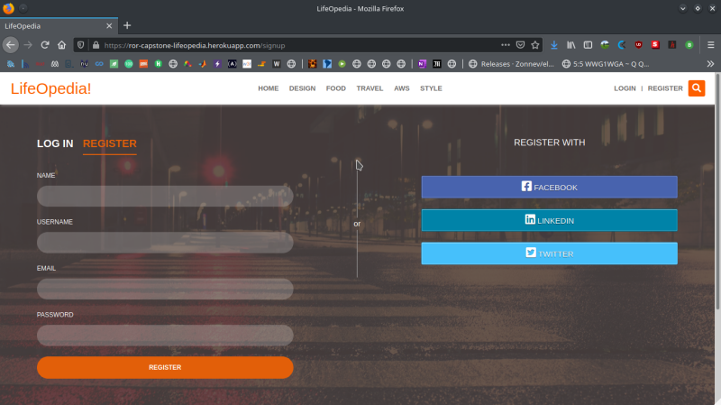
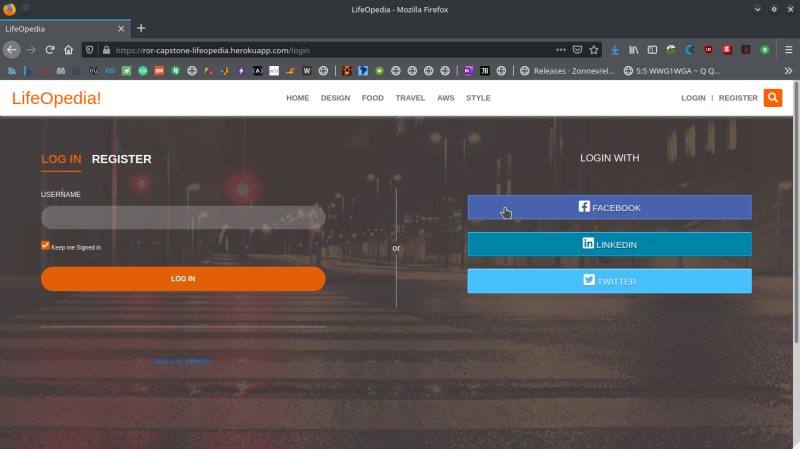
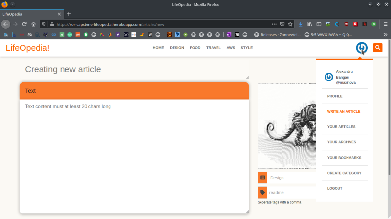
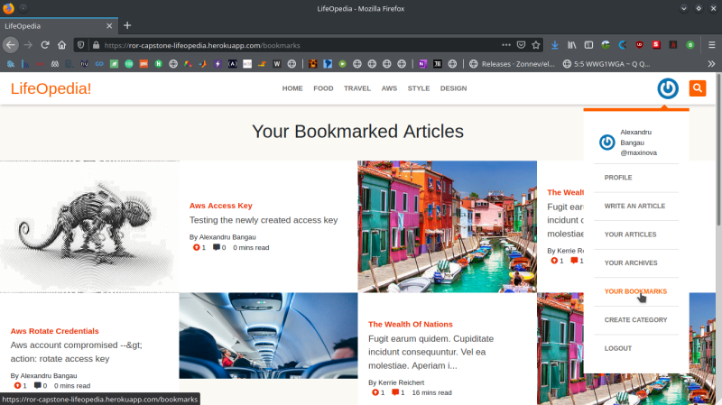
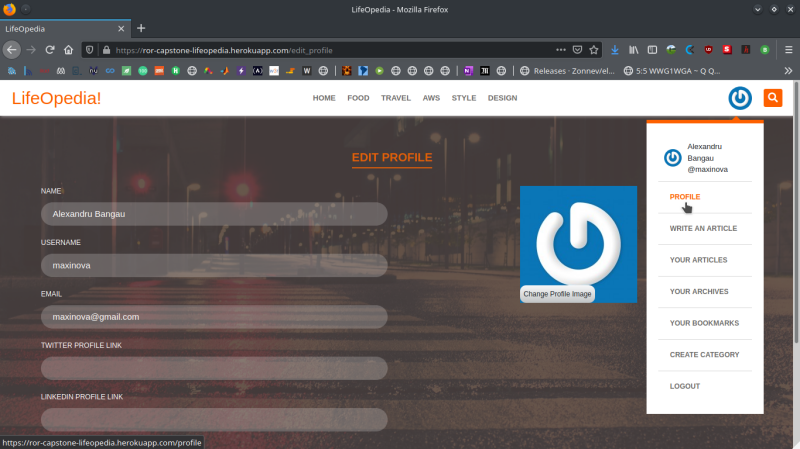
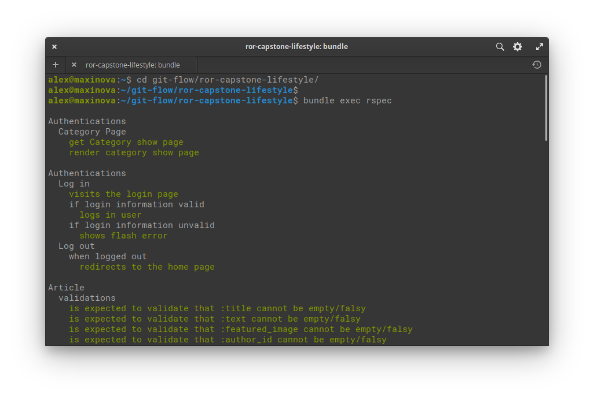
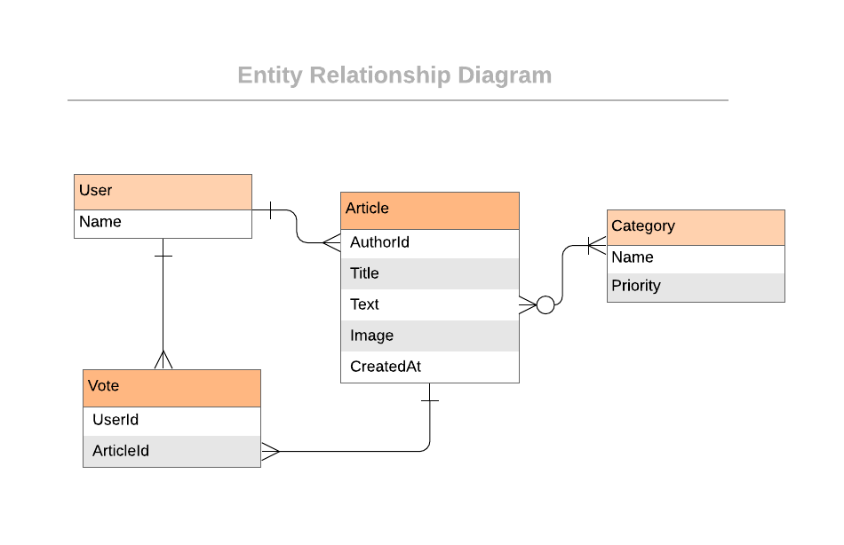

<!--
*** Thanks for checking out this README Template. If you have a suggestion that would
*** make this better, please fork the repo and create a pull request or simply open
*** an issue with the tag "enhancement".
*** Thanks again! Now go create something AMAZING! :D
-->

<!-- PROJECT SHIELDS -->
<!--
*** I'm using markdown "reference style" links for readability.
*** Reference links are enclosed in brackets [ ] instead of parentheses ( ).
*** See the bottom of this document for the declaration of the reference variables
*** for contributors-url, forks-url, etc. This is an optional, concise syntax you may use.
*** https://www.markdownguide.org/basic-syntax/#reference-style-links
-->
[![Contributors][contributors-shield]][contributors-url]
[![Forks][forks-shield]][forks-url]
[![Stargazers][stars-shield]][stars-url]
[![Issues][issues-shield]][issues-url]


<!-- PROJECT LOGO -->
<br />
<p align="center">
  <a href="https://github.com/rammazzoti2000/ror-capstone-lifestyle">
    
  </a>

  <h3 align="center">RoR / Capstone --> [LifeOpedia!]</h3>

  <p align="center">
    This project is the Capstone of the Microverse curriculum at the end of the Ruby on Rails module!
    <br />
    <a href="https://github.com/rammazzoti2000/ror-capstone-lifestyle"><strong>Explore the docs »</strong></a>
    <br />
    <br />
    <a href="https://github.com/rammazzoti2000/ror-capstone-lifestyle/issues">Report Bug</a>
    ·
    <a href="https://github.com/rammazzoti2000/ror-capstone-lifestyle/issues">Request Feature</a>
  </p>
</p>

<!-- TABLE OF CONTENTS -->
## Table of Contents

* [About the Project](#about-the-project)
  * [Built With](#built-with)
  * [Walkthrough Video and Deployment (Heroku)](#walkthrough-video-and-deployment-(heroku))
* [Usage](#usage)
* [Database Structure](#database-structure)
* [Contributors](#contributors)
* [Acknowledgements](#acknowledgements)
* [License](#license)

<!-- ABOUT THE PROJECT -->
## About The Project

This is the Capstone project that signs the completion of the RubyOnRails module in Microverse Curriculum.
It is a webapp where users can register using name, username, password and can signin with their username only.
As a logged in user, it is possible to create articles, edit profile, comment, vote and bookmark an article for future reads.
The app can be used also on read only mode, with restricted access to its features.



### Built With
This project was built using these technologies.
* Ruby & Ruby on Rails
* Rspec / Capybara
* Bootstrap
* HTML / CSS / SCSS
* SQLite
* Rubocop
* GithubActions :muscle:
* Atom :atom:

<!-- Live Demo -->
## Walkthrough Video and Deployment (Heroku)
https://www.loom.com/share/291f99a17d0542e09a48fd3f7c0e83cc
##
* Live Demo Link --> App Deployed with Heroku: [ror-capstone-lifeopedia](https://ror-capstone-lifeopedia.herokuapp.com/) :point_left:

### Getting Started

To get a local copy up and running follow these simple example steps.

### Prerequisites

Ruby: 2.7.0
Rails: 5.2.4

### Clone
* [download](https://github.com/rammazzoti2000/ror-capstone-lifestyle/archive/development.zip) or clone this repo:
  - Clone with SSH:
  ```
    git@github.com:rammazzoti2000/ror-capstone-lifestyle.git
  ```
  - Clone with HTTPS
  ```
    https://github.com/rammazzoti2000/ror-capstone-lifestyle.git

### Setup

Install gems with:

```
$ bundler install --without production
```

Setup database with:

```
$ rails db:migrate
$ rails db:seed
```

### Usage

Start server with:

```
$ rails server
```

Open `http://localhost:3000/` in your browser and sing in with a user already defined --> :point_right: ```maxinova``` :point_left:
- for any technical problems running ```rails db:migrate:reset && rails db:seed``` should solve it

#### Create User

Fill the sign up form to create a user



#### Login

Use only the username to login



#### Create a new article from the dropdown menu

Type your title and text, add an image, category and a tag



#### Bookmarked articles

Articles can be bookmarked and will be saved in `Your Bookmars`



#### Edit User Profile

User profile can be edited along with the profile's picture



  ## Automated Test

* Run the command and see the output: 
```$ bundle exec rspec```


## Database Structure
 * Database schema used for this project reflects the following structure:
 
 
 ## Potential future features
- Extend the signin / signup process to social accounts, use verfied email process
- Improve the front-end

<!-- CONTACT -->
## Contributors

👤 **Alexandru Bangau**

- LinkedIn: [Alexandru Bangau](https://www.linkedin.com/in/alexandru-bangau/)
- GitHub: [@rammazzoti2000](https://github.com/rammazzoti2000)
- E-mail: bangau.alexandru@gmail.com
- Project [Link](https://github.com/rammazzoti2000/ror-capstone-lifestyle/)

## :handshake: Contributing

Contributions, issues and feature requests are welcome!

Feel free to check the [issues page](https://github.com/rammazzoti2000/ror-capstone-lifestyle/issues).

## Show your support

Give a :star: if you like this project!


<!-- ACKNOWLEDGEMENTS -->
## Acknowledgements
* [Microverse](https://www.microverse.org/)
* [Ruby Documentation](https://www.ruby-lang.org/en/documentation/)
* [Ruby on Rails](https://rubyonrails.org/)
* [Bootstrap](https://getbootstrap.com/)
* [Behance](https://www.behance.net/)
* [Heroku](https://www.heroku.com/)

## Credits
* Nelson Sakwa - [liFEstIye](https://www.behance.net/gallery/14554909/liFEsTlye-Mobile-version)

<!-- MARKDOWN LINKS & IMAGES -->
<!-- https://www.markdownguide.org/basic-syntax/#reference-style-links -->
[contributors-shield]: https://img.shields.io/github/contributors/rammazzoti2000/ror-capstone-lifestyle.svg?style=flat-square
[contributors-url]: https://github.com/rammazzoti2000/ror-capstone-lifestyle/graphs/contributors
[forks-shield]: https://img.shields.io/github/forks/rammazzoti2000/ror-capstone-lifestyle.svg?style=flat-square
[forks-url]: https://github.com/rammazzoti2000/ror-capstone-lifestyle/network/members
[stars-shield]: https://img.shields.io/github/stars/rammazzoti2000/ror-capstone-lifestyle.svg?style=flat-square
[stars-url]: https://github.com/rammazzoti2000/ror-capstone-lifestyle/stargazers
[issues-shield]: https://img.shields.io/github/issues/rammazzoti2000/ror-capstone-lifestyle.svg?style=flat-square
[issues-url]: https://github.com/rammazzoti2000/ror-capstone-lifestyle/issues

## 📝 License

This project is [MIT](https://opensource.org/licenses/MIT) licensed.
